# GitLabSmith

A GitLab CI/CD configuration refactoring and validation tool for safe pipeline transformations.

## Quick Start

```bash
# Parse a GitLab CI file
./gitlab-smith parse .gitlab-ci.yml

# Build from source
go build -o gitlab-smith ./cmd/gitlab-smith
```

## Current Status

**Phase 1: Core Parser** ✅ 
- GitLab CI YAML parsing with dependency mapping
- JSON output for analysis and integration
- Command-line interface for file parsing

**Phase 2: Semantic Analysis & Visual Rendering** ✅ (Current implementation)
- Configuration comparison and diffing
- Static analysis with optimization suggestions
- Visual pipeline diagrams (Mermaid & DOT formats)
- Side-by-side visual comparison of refactored pipelines

**Phase 3: Local Testing** (Future)
- Local GitLab deployment for behavioral validation
- Performance benchmarking and comparison

## Installation

### Prerequisites
- Go 1.21+ 
- Unix/Linux environment

### From Source
```bash
git clone <repository-url>
cd gitlab-smith
go build -o gitlab-smith ./cmd/gitlab-smith
```

## Usage

### Parse GitLab CI Configuration
```bash
./gitlab-smith parse path/to/.gitlab-ci.yml
```

Outputs structured JSON representation of the GitLab CI configuration including:
- Job definitions with dependencies
- Stage configurations
- Variable definitions
- Include directives

### Visual Pipeline Representation

Generate visual diagrams of your GitLab CI pipelines to better understand job dependencies and execution flow:

```bash
# Generate Mermaid diagram (view online at mermaid.live)
./gitlab-smith visualize .gitlab-ci.yml --format mermaid

# Generate DOT graph (convert to PNG with Graphviz)
./gitlab-smith visualize .gitlab-ci.yml --format dot --output pipeline.dot
dot -Tpng -o pipeline.png pipeline.dot
```

**Example Pipeline Visualization:**

```mermaid
flowchart TD
  subgraph S0["build"]
    build["build"]:::buildJob
  end

  subgraph S1["test"]
    test_unit["test"]:::testJob
    test_integration["test"]:::testJob
  end

  subgraph S2["deploy"]
    deploy_staging["deploy"]:::deployJob
    deploy_production["deploy"]:::deployJob
  end

  build --> test_unit
  build --> test_integration
  test_unit --> deploy_staging
  test_integration --> deploy_staging
  test_unit --> deploy_production
  test_integration --> deploy_production

  classDef buildJob fill:#e1f5fe
  classDef testJob fill:#f3e5f5
  classDef deployJob fill:#e8f5e8
```



### Configuration Comparison & Refactoring

Compare two GitLab CI configurations to understand the impact of refactoring changes:

```bash
# Semantic comparison with static analysis
./gitlab-smith refactor --old old-config.yml --new new-config.yml

# Visual comparison showing before/after pipeline structure
./gitlab-smith refactor --old old-config.yml --new new-config.yml --pipeline-compare --format mermaid

# Full testing mode with local GitLab deployment
./gitlab-smith refactor --old old-config.yml --new new-config.yml --full-test
```

## Documentation

- **[CLAUDE.md](CLAUDE.md)** - Development guide for contributors and Claude Code
- **[pipeline-emulator-spec.md](pipeline-emulator-spec.md)** - Complete technical specification and architecture

## Contributing

See [CLAUDE.md](CLAUDE.md) for development setup and project structure.

## License

TBD